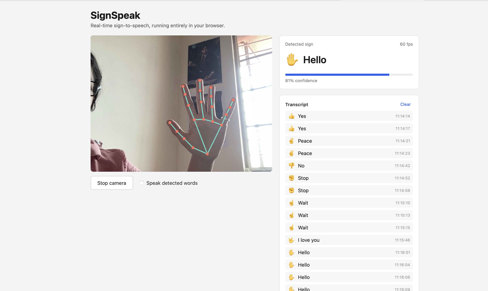

# 👋 SignSpeak — Your Hand Talks. Your Browser Listens.


git status

Ever wished your browser could understand a 👍 without you clicking anything?
**SignSpeak** is a real-time sign language recognition web app that watches your hand through your webcam, recognizes simple gestures, converts them into text, and even says them out loud.

No servers.
No API keys.
No "AI magic" happening somewhere in the cloud.

Your webcam stays on **your computer**. Everything runs directly inside the browser.
---

# 📸 Preview

Here's SignSpeak in action!

<p align="center">
  
</p>

The app detects your hand in real time, recognizes the gesture, displays the confidence score, keeps a transcript of recognized words, and can even speak them aloud.
---

## 🎬 Demo

1. Turn on your webcam.
2. Show a hand gesture.
3. Hold it steady for a second.
4. Hear your browser proudly announce your decision.

```
👍  →  "Yes"
✌️  →  "Peace"
🖐️  →  "Hello"
👊  →  "Stop"
```

It's basically a tiny interpreter that never asks for a coffee break.

---

# ✨ Features

- 🎥 Live webcam recognition
- 🤖 On-device ML (no backend required)
- 📝 Running transcript
- 🔊 Text-to-speech output
- ⚡ Runs entirely inside your browser
- 🔒 No video leaves your device

---

# 🛠 Tech Stack

| Layer | Tool | Why? |
|-------|------|------|
| UI | React | React and state management just make this kind of app pleasant to build. |
| Gesture Recognition | MediaPipe Tasks Vision | Google's pre-trained GestureRecognizer running locally using TensorFlow Lite + WebAssembly. |
| Speech | Web Speech API | Built into modern browsers. Free. Fast. Doesn't ask for an API key every five minutes. |

---

# 🧠 How it Works

```
 Webcam
    │
    ▼
 MediaPipe GestureRecognizer
    │
    ▼
 Detect Gesture + Confidence
    │
    ▼
 Hold-to-Commit Logic
    │
    ├────────► Transcript
    │
    └────────► Speech Synthesis
```

Simple enough to explain in an interview.
Interesting enough to build.

---

# 🚀 Pipeline

### 1️⃣ Camera

The browser politely asks,

> "Can I borrow your camera?"

If you say yes, `getUserMedia()` starts streaming video.

Nothing gets uploaded.

Promise.

---

### 2️⃣ Recognition

Every video frame is sent into MediaPipe's `GestureRecognizer`.

Internally it:

- detects your hand
- finds 21 landmarks
- predicts which gesture you're making
- gives a confidence score

All locally.

Your internet connection can relax.

---

### 3️⃣ The "Please Don't Spam Me" Logic

Webcams run around **30 FPS**.

Without any filtering...

```
👍
👍
👍
👍
👍
👍
👍
👍
👍
👍
👍
```

...your speakers would scream

```
YES YES YES YES YES YES YES YES YES
```

approximately 30 times every second.

Not ideal.

So the app waits until a gesture is held for about **0.9 seconds** before accepting it.

Then it refuses to repeat the same word again for **2.5 seconds**.

This tiny debounce logic is honestly the MVP of the project.

---

### 4️⃣ Vocabulary

MediaPipe gives labels like

```
Thumb_Up
```

The app translates them into something humans actually say.

```
Thumb_Up
      ↓
Yes 👍
```

One lookup table.
Easy to extend.
Easy to understand.

---

### 5️⃣ Speak!

Once a gesture is accepted:

- add it to the transcript
- speak it aloud
- wait for the next gesture

Congratulations.

Your browser has become mildly conversational.

---

# 📁 Project Structure

```
src/
│
├── App.jsx
│     Main app + debounce logic
│
├── hooks/
│     useGestureRecognizer.js
│
├── components/
│     WebcamStage.jsx
│     GesturePanel.jsx
│     TranscriptLog.jsx
│
├── data/
│     gestureMap.js
│
└── utils/
      speech.js
```

Nothing too scary.

---

# ▶️ Running Locally

```bash
npm install
npm run dev
```

Open the local URL.

Click **Start Camera**.

Allow camera permission.

Wave your hand around like you're explaining something to an invisible audience.

---

Production build:

```bash
npm run build
```

---

# 📚 Current Vocabulary

| Gesture | Says |
|----------|------|
| 👍 Thumb Up | Yes |
| 👎 Thumb Down | No |
| 🖐 Open Palm | Hello |
| 👊 Closed Fist | Stop |
| ✌️ Peace | Peace |
| ☝️ Pointing Up | Wait |
| 🤟 I Love You | I love you |

MediaPipe already knows these.

I'm just giving them a microphone.

---

# 🤔 Why No Backend?

Because...

- lower latency
- easier deployment
- better privacy
- cheaper hosting
- one less thing to debug at 2 AM

Sometimes the best backend is...

no backend.

---

# 💡 Future Improvements

- Learn custom gestures
- Two-hand recognition
- Better ISL/ASL support
- Sentence formation
- Gesture history
- Confidence graphs
- Dark mode (because every project eventually gets one)

---

# ⚠️ Limitations

This isn't a full sign language interpreter.

It recognizes a handful of **static hand gestures**.

Real sign languages involve:

- movement
- timing
- facial expressions
- body posture
- two-handed signs

That's a much bigger machine learning problem.

---

# 🎯 What I Learned

Building this project taught me more than just using MediaPipe.

I learned about:

- browser media APIs
- running ML models on-device
- React state management
- animation loops
- debouncing real-time events
- making software that doesn't shout "YES" thirty times a second

---

# 🙌 Acknowledgements

Huge thanks to:

- Google MediaPipe
- TensorFlow Lite
- React
- Web Speech API

...for doing the hard work so I could glue everything together and pretend I knew what I was doing.

---

If you found this project interesting,

⭐ consider starring the repo.
